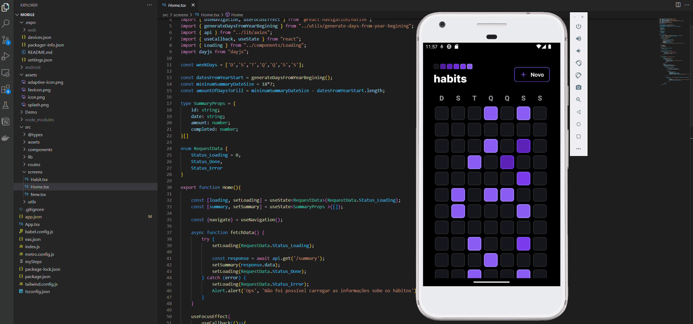

# 📱 HabitToolMobile
Um projeto de frontend de estudo desenvolvido durante o evento @Rocketset Ignite.

## 📜 Descrição
HabitToolMobile é a interface do usuário do aplicativo HabitTool, um sistema para acompanhar e manter um registro de hábitos diários. Este repositório contém o código-fonte do aplicativo mobile, desenvolvido com React Native e Expo.

## ✨ Recursos/Funcionalidades
- Registro de hábitos diários
- Visualização do progresso de hábitos
- Definição de metas e lembretes
- Personalização da aparência da interface

## ⚙️ Pré-requisitos
- Node.js (versão X.X.X)
- npm (gerenciador de pacotes do Node.js)
- Expo CLI (instalado globalmente)

## 🚀 Instalação
1. Clone o repositório para o seu ambiente local:
git clone https://github.com/RomuloRamos/HabitToolMobile.git
2. Acesse o diretório do projeto:
cd HabitToolMobile
3. Instale as dependências:
npm install
4. Inicie o aplicativo:
expo start
5. Abra o aplicativo no seu dispositivo móvel usando o Expo Client ou em um emulador.

## 💡 Uso

- Adicione hábitos diários que deseja acompanhar.
- Marque os hábitos como concluídos todos os dias.
- Acompanhe o progresso e visualize estatísticas dos seus hábitos.

## 🤝 Contribuição
Contribuições são bem-vindas! Sinta-se à vontade para enviar solicitações de pull com melhorias, correções de bugs ou novos recursos. Para contribuir com o projeto, siga estas etapas:
1. Faça um fork do repositório.
2. Crie uma nova branch para suas alterações: `git checkout -b minha-feature`
3. Faça as alterações desejadas e commit.
4. Envie suas alterações para o seu fork: `git push origin minha-feature`
5. Envie uma solicitação de pull no GitHub.

## 📄 Licença
Este projeto está licenciado sob a [MIT License](https://opensource.org/licenses/MIT).

## ✍️ Autor
- Nome: Rômulo Ramos
- Email: romulo.ramos@gee.inatel.br

## 📝 Notas Adicionais
- Para obter mais informações sobre o backend do HabitTool, consulte o [repositório do HabitToolServer](https://github.com/RomuloRamos/HabitToolServer).
- Conheça também a versão Web deste projeto, consulte o [repositório do HabitToolFrontend](https://github.com/RomuloRamos/HabitToolFrontend).
- Para relatar problemas ou solicitar novos recursos, crie uma issue neste repositório.

---

## ℹ️ Passos Adicionais (mysteps)
Siga os passos abaixo para configurar seu ambiente de desenvolvimento para o projeto HabitToolMobile:

1. Certifique-se de ter o Node.js e o npm instalados em seu sistema.
2. Instale o Expo CLI globalmente executando o seguint
